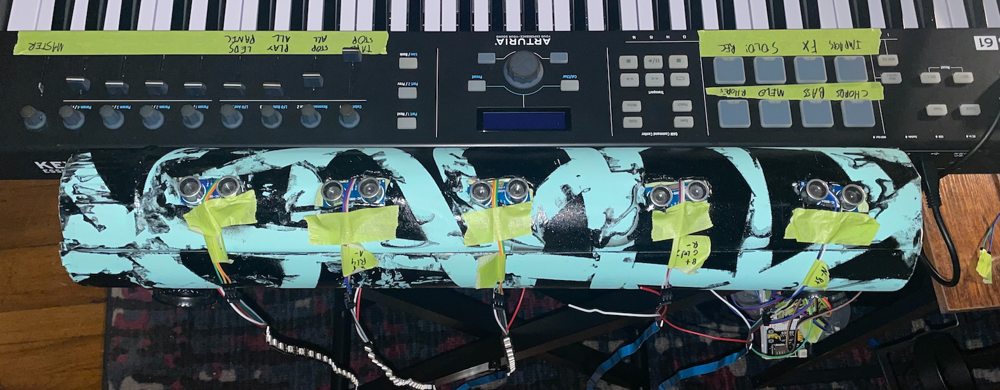

# Performance project

The Galaxy Harp is essentially a sensor based MIDI controller with some LED strip functionality. The code is written in Arduino for Teensy 4.0 board.

In order to perform with it, the Galaxy Harp needs to be plugged into a computer with and it expects MIDI through that usb connection, it is thought to be used along with a midi keyboard to tell the instrument what notes and chords to play. 

Galaxy Harp will expect midi notes and CC's to be controlled. The instrument has multiple programs that react differently to the midi messages sent.

A video of the demo performance can be found [here](https://www.youtube.com/watch?v=MCmFHHlN2C4).

## List of necessary materials

In order to build the instrument the following are needed:

* WS2812B LED Strip x5 
* HC-SR04 Ultrasonic Sensor x5
* Multiple length jumper wires 
* PVC Pipe for casing 
* Power station for breadboard 
* Power cable for the station 

## Some implementation details (MIDI based protocol)
We can change the program with program change MIDI messages. Depending on the selected program, the Galaxy Harp will show different behaviours:
#### Program changes in the Teensy Module:
1. **Normal Mode:** Receives and registers midi notes, and launches a stepped animation (Led 1 for a couple of milliseconds, then led 2 then led 3...) and the associated MIDI note after the hand is detected.
2. **Fade Mode:** Similar to the normal mode, but the animation consists of the whole LED strip firing up, and then fading away.
3. **Proximity Mode 1:** Notes are also registered and associated to each sensor, but the proximity is actually registered and used to send channel pressure and move the light animation around the strip.
4. **Proximity Mode 2:** Very similar to the previous one, but we change the brightness of the strip
5. **Proximity ALL mode:** Similar to 4, but the brightness is applied along all of the strips, and all the notes are triggered. This is the mode to play chords.
6. **Buttons mode:** Sends midi proximity trigger values in CC 20, 21, 22, 23, 24... Mainly for controlling effects.

## Protocol to fire LED strips from Ableton
There are some MIDI CC's that will fire the led strips. All of the standard MIDI notes are expected on channel 1, but the LED strips can be animated by firing animations. Channels starting from 11 will create an animation in the style of each of the programs listed above. (11 corresponds to program 1, 12 to program 2 etc.)